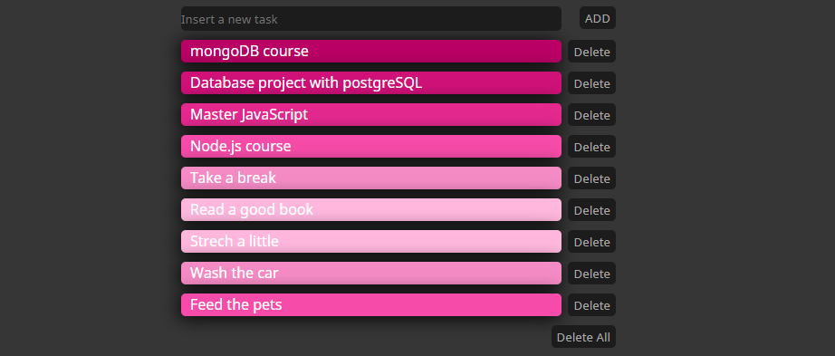

# SIMPLE TODO LIST

## This is my hello world in JavaScript.

I built this app following the Rocketseat's starter JavaScript Course (https://skylab.rocketseat.com.br/node/curso-java-script).

## Technologies involved

### HMTL5

This technology is the base of the whole web development, this is a markup language that is responsible to put the things together and is the skeleton of any the frontend.

### CSS3

Once HTML5 is the base of a web-page, CSS3 is what makes everything looks beautiful, giving a better experience to the user end. It is responsible for the stylization of the content, positioning and some animations in front-end.

### Vanilla JavaScript

JavaScript is the only language that the browser can understand, and in the context of this app, it is responsible to manipulate the DOM-elements on the client-side.

## Goals of this brief project

My aiming when I jump into this project was, understand the main concepts of the web-page's composition.

I could applied many key concepts upon this brief journey:

- Structuring with HTML5, using the main tags;

- DOM-manipulation with Vanilla JavaScript;

- Storage of the data in the browser's local storage.

- And stylization using CSS3;

# Importante NOTE:

## To use this app properly you must run it in Google Chrome browser.
